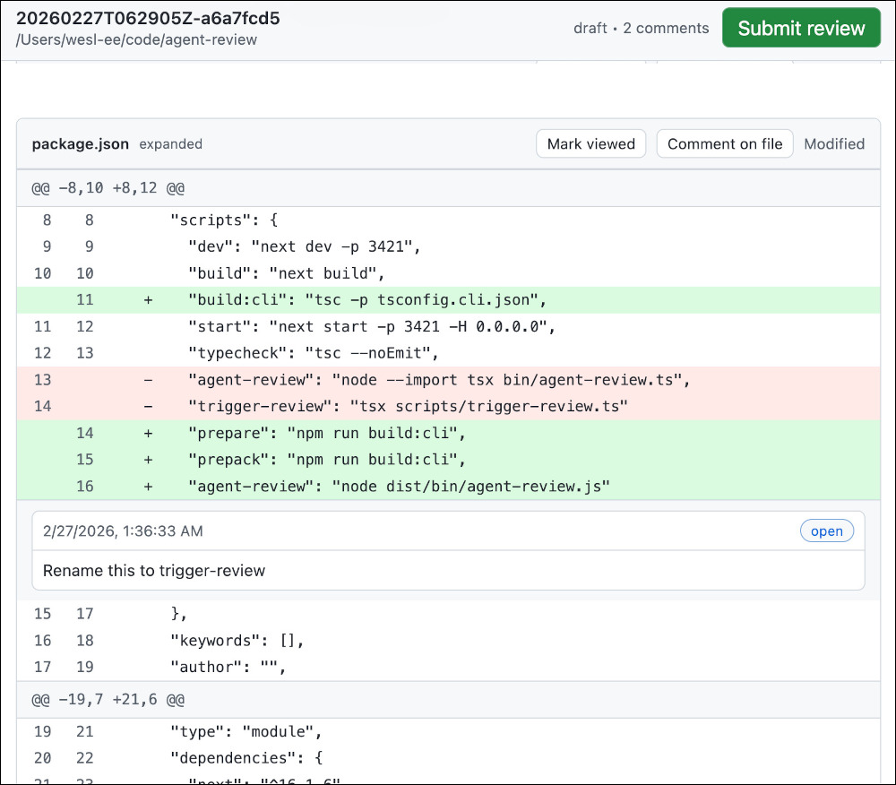

agent-review
============

Locally review code from a coding agent before committing upstream. Enables
infinite **human-in-the-loop** iteration over agent-produced code for better
code overall :)



Prerequisites
-------------

Ensure these packages / daemons are installed locally:

- node + npm
- Docker daemon + cli
- git

Installation
------------

```bash
npm install -g github:wesl-ee/agent-review#v0.1.0

# verify
agent-review --help
```

Usage
-----

Below is a snippet from my AGENTS.MD file. Tailor to your needs.

```
## agent-review
- use if I request to review your code. to start: agent-review trigger . provide the URL
- to review / reply: agent-review comments <review-id>, agent-review resolve <review-id> <comment-id>
```

LICENSE
-------

MIT License (available under `/LICENSE`)
